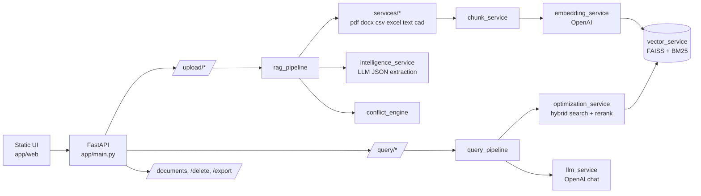

# TenderLens — AI-Powered RFQ Intelligence Platform


Upload the documents of an engineering RFQ (PDF, Word, Excel BOQ, CSV, text, DXF/DWG). Then ask questions about quantities and specifications, and check whether different documents disagree about the same item.

The system is a FastAPI backend with a single-page static frontend. It uses hybrid retrieval (FAISS + BM25) with cross-encoder reranking, and OpenAI for embeddings and answers.

---

## Features

- **Multi-format ingestion:** PDF (PyMuPDF), DOCX including tables (python-docx), CSV, XLSX/XLS BOQ (pandas), TXT, DXF/DWG (ezdxf, plus ODA File Converter for DWG)
- **Hybrid retrieval:** FAISS cosine search plus BM25 keyword search, merged with Reciprocal Rank Fusion
- **Reranking:** `cross-encoder/ms-marco-MiniLM-L-6-v2` re-scores candidates and yields a confidence value; if the model cannot load, results fall back to un-reranked hybrid order
- **Chat with sources:** `/query/ask` returns an answer, source filenames, chunks used and confidence
- **Cross-document conflict detection:** groups similar item names (difflib, numbers must match), sums quantities per source, and flags items whose totals differ
- **Structured extraction:** an LLM pass produces `{project, items[]}` JSON per document, saved under `deliverables/`
- **CSV export** of the conflict report

## Architecture



```
app/
├── main.py                    # app, lifespan (load/save index), router registration
├── config.py                  # env-driven settings; fails fast without OPENAI_API_KEY
├── routers/                   # upload_router, query_router, document_router
├── pipeline/                  # rag_pipeline, query_pipeline, optimization_service, intelligence_service
├── brain/                     # vector, embedding, llm, chunk, conflict, document services
├── extraction/                # regex BOM / spec / table extractors
├── services/                  # per-format text extractors
├── models/                    # Pydantic schemas
└── web/                       # index.html, app.js, style.css
```

**Ingest flow:** upload → format parser → chunk → embed → FAISS/BM25 index (persisted in `vectorstore/`) → BOM/spec/table extraction + LLM extraction → conflict check → JSON in `deliverables/`.

**Chat flow:** question → embed → hybrid search (top 20) → rerank (top *k*) → context assembly (`MAX_CONTEXT_CHARS`) → LLM answer.

## Setup

**Prerequisites:** Python 3.10+, an OpenAI API key, internet access on first query (the reranker model is downloaded from Hugging Face). For `.dwg` files only: [ODA File Converter](https://www.opendesign.com/guestfiles/oda_file_converter).

```bash
git clone https://github.com/Jayasingh174/AI-Powered-RFQ-Intelligence-Platform.git
cd AI-Powered-RFQ-Intelligence-Platform
python -m venv venv
source venv/bin/activate          # Windows: venv\Scripts\activate
pip install -r requirements.txt
cp .env.example .env              # then edit; see below
uvicorn app.main:app --reload     # run from the repo root
```

Open http://localhost:8000 (API docs at `/docs`).

### Environment variables

| Variable | Default | Notes |
|---|---|---|
| `OPENAI_API_KEY` | none | **Required.** App refuses to start without it |
| `OPENAI_MODEL` | `gpt-4o-mini` | Chat model |
| `OPENAI_TEMPERATURE` / `OPENAI_MAX_TOKENS` / `MAX_RETRIES` | `0.0` / `2000` / `3` | |
| `EMBEDDING_MODEL` / `EMBEDDING_DIMENSION` | `text-embedding-3-large` / `3072` | Keep the two consistent; changing them requires re-indexing |
| `CHUNK_SIZE` / `CHUNK_OVERLAP` | `1000` / `200` | |
| `MAX_CONTEXT_CHARS` | `12000` | Context budget sent to the LLM |
| `UPLOAD_DIR` / `SAVE_DIR` / `DWG_TEMP_DIR` | `uploads` / `vectorstore` / `temp_dxf` | |
| `ALLOWED_FILE_TYPES` / `MAX_UPLOAD_SIZE_MB` | `docx,pdf,dwg,dxf,txt,csv,xlsx,xls` / `50` | |
| `ODA_PATH` | empty | Path to the ODA converter executable; needed for `.dwg` only |

## API

| Method | Endpoint | Purpose |
|---|---|---|
| `POST` | `/upload/bundle` | Multipart: `project_name`, `files[]`. Indexes files, extracts entities, returns the conflict analysis |
| `POST` | `/upload/process` | Re-process one file already on the server (`{"file_path": "uploads/x.pdf"}`) |
| `POST` | `/query/ask` | `{"question": "...", "top_k": 8}` → answer, sources, confidence |
| `POST` | `/query/search` | Raw hybrid search + rerank, no LLM |
| `GET` | `/documents` | List files in `uploads/` |
| `DELETE` | `/delete/{filename}` | Delete the file and its chunks from the index |
| `POST` | `/export/conflicts` | Turn a conflict report into a CSV download |

## Known issues (from a code audit)

These are confirmed in the source and should be fixed before a demo:

1. `upload_router.py` imports `RFQRequest`/`RFQResponse`, but `models/rag_model.py` defines `RAGRequest`/`RAGResponse`, so the server fails to start.
2. `query_pipeline.py` calls `compress_context(..., max_tokens=...)`; the parameter is `max_chars`, so chat answers fail.
3. `llm_service.py` sends `"..."` as the system prompt, so answers are not constrained to the documents.
4. BOM rows use `part`/`qty` but the bundle reads `item`/`quantity`; CAD entities are not converted into conflict entities.
5. `.dxf` files are routed through the ODA converter, which is meant for `.dwg`.

See `AUDIT_REPORT.md` for the full list, evidence and file/line references.

## Limitations

- Merged cells in DOCX tables can appear duplicated in extracted text.
- The `marked` script on the CDN is not version-pinned and has no SRI hash.
- Index persistence uses `pickle`; keep `vectorstore/` private.
- CORS is open (`*`); restrict it before deploying.

## Author

Jaya Singh, B.Tech CSE. Focus: RAG pipelines, multi-agent systems, LLM applications.
